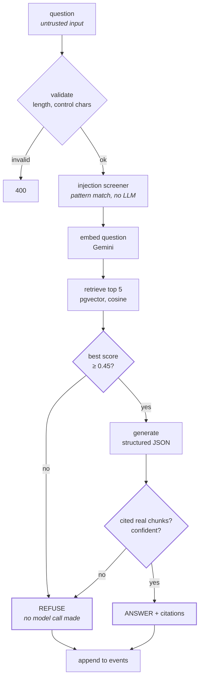
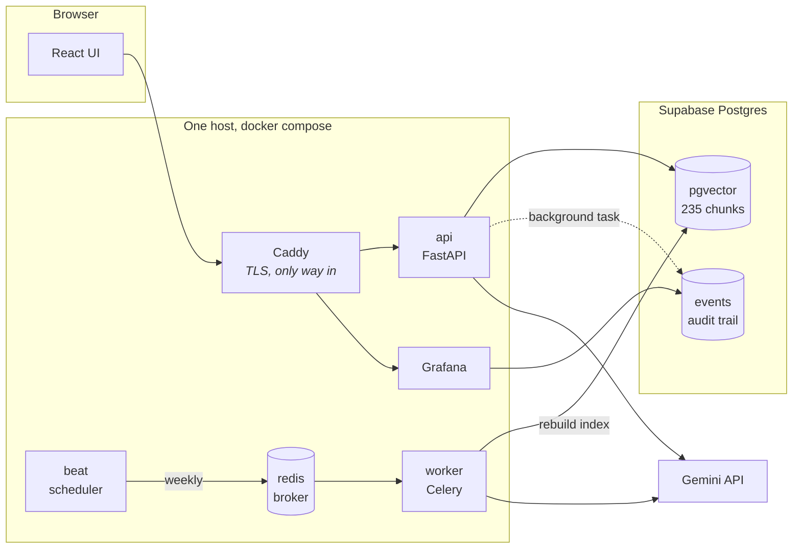
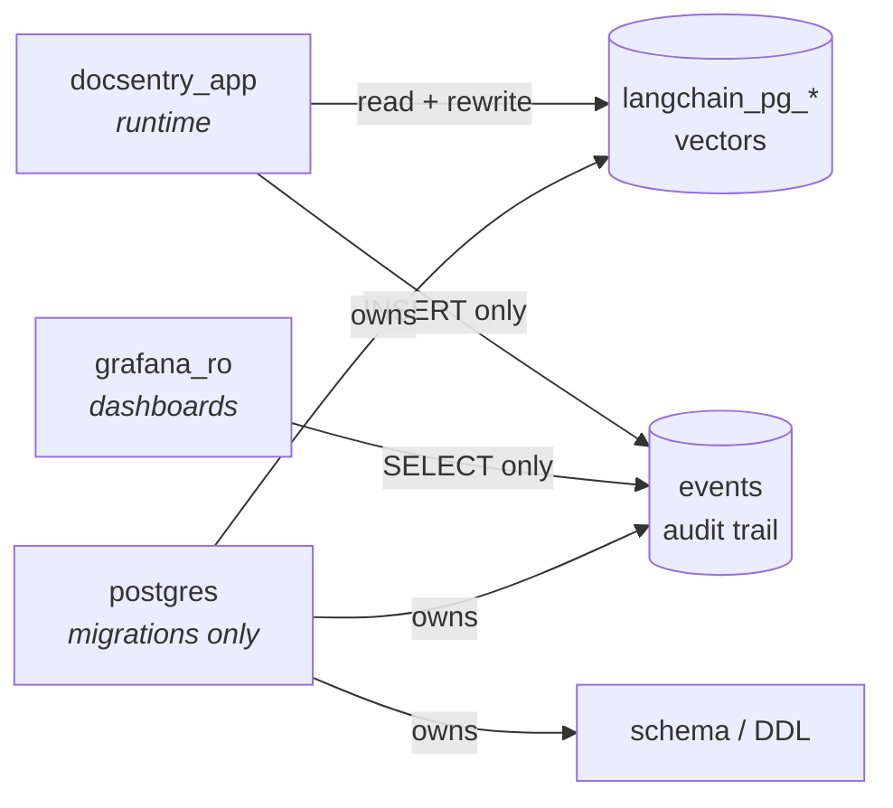
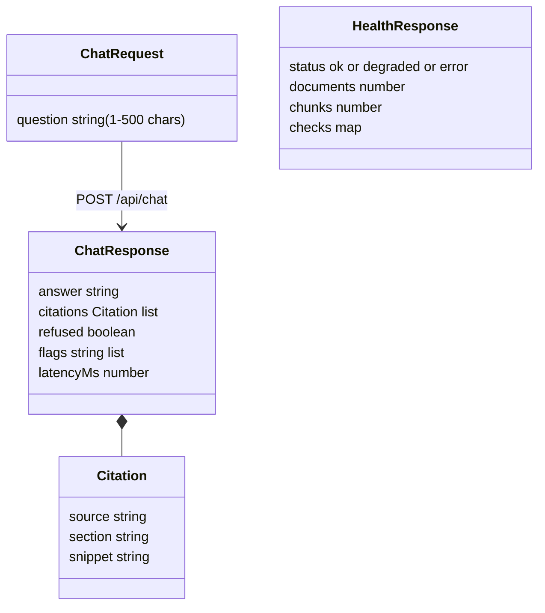
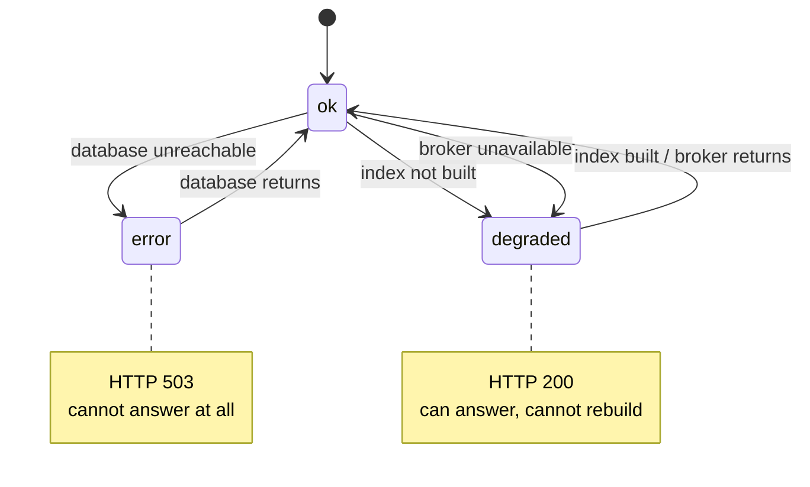

# DocSentry — Document Q&A with Guardrails

A RAG service over a fictional company handbook. It answers with citations, refuses when the answer is not in the documents, and flags prompt-injection attempts rather than obeying them.

The claim it has to survive is narrow and testable: **the model advises, code decides.** Every check that determines whether an answer reaches a user runs in plain Python, never as an instruction in a prompt.

---

## The answer path



Two gates, and they do different jobs. Worth being precise, because the obvious reading is wrong:

| Gate | What it actually catches | Measured |
|---|---|---|
| Score threshold (0.45) | Questions nowhere near the corpus. Saves a model call. | All 26 unanswerable labels score **above** it |
| Citation check | Everything else. **This is the grounding guarantee.** | Catches the unanswerable cases the threshold lets through |

The threshold is a cost optimisation that also happens to filter. The citation check is the safety property.

---

## Where things run



The api port is never published. Caddy is the only route in, which is what makes `X-Forwarded-For` trustworthy enough to rate-limit on.

**Two deployment shapes**, from the same image:

| | Full stack | API only (Render) |
|---|---|---|
| Answers questions | yes | yes |
| Rebuilds the index | yes | **no** — no worker |
| TLS | Caddy | platform |
| Dashboards | Grafana | none |
| Health reports | `ok` | `degraded` |

`degraded` on Render is correct, not a fault. A missing broker means rebuilds are impossible; it does not mean answers are.

---

## Database roles

Each connection has only what it needs. The application ran as the owner until this was split out, which meant every request carried the authority to drop the schema.



`events` is append-only to the application deliberately. It writes audit rows and never reads them back; Grafana does that. A process that cannot rewrite the record of what it did is a better audit trail.

**Row level security is on for every table.** Supabase enables it by default and the owner bypasses it, so a `GRANT` without a matching policy produces a role that connects successfully and reads **zero rows, with no error**. That failure looks exactly like an empty index. Policies, not grants, are what make these arrows real.

---

## Layout

```
docsentry/
├── backend/
│   ├── app/
│   │   ├── main.py          FastAPI routes, health, rate limit, audit dispatch
│   │   ├── rag.py           LCEL chain: retrieve → gate → generate → verify
│   │   ├── guardrails.py    validation, injection patterns, 0.45 threshold
│   │   ├── db.py            connection, audit write, collection queries
│   │   ├── ingest.py        chunk + embed docs/ into pgvector
│   │   ├── tasks.py         reindex Celery task
│   │   ├── celery_app.py    broker config + Beat schedule
│   │   ├── observability.py Sentry, with request bodies scrubbed
│   │   └── schemas.py       pydantic models
│   ├── alembic/             schema migrations (owns the vector extension)
│   ├── docs/                25 markdown policy documents
│   └── tests/
│       ├── test_grounding.py      21  refusal and citation behaviour
│       ├── test_guardrails.py     32  injection patterns, validation
│       ├── test_api_routes.py     11  health states, audit trail
│       ├── test_observability.py   7  Sentry scrubbing
│       └── eval/                      150 labels, ablation, injection suite
├── frontend/                React + Vite chat UI
├── deploy/                  Caddyfile, Grafana provisioning
├── docker-compose.yml       full stack
├── docker-compose.dev.yml   local Postgres only
└── render.yaml              API-only deployment
```

---

## API contract

Frozen. Both sides build to this.



`flags` carries `prompt_injection_suspected`, `off_topic` and `model_unavailable`. They are distinct values, not a single "something happened" signal — counting any flag as an injection overstates attacks, which is a mistake this project has already made once.

---

## Health, and what each state means



This distinction is the whole point of the endpoint. An earlier version returned `ok` unconditionally by catching the missing-index exception and reporting zeros, which meant it stayed green through the exact outage it existed to catch. It is now tested against each dependency being deliberately stopped.

---

## Guardrails

| # | Layer | Runs | Fails to |
|---|---|---|---|
| 1 | Input validation | before anything | 400 |
| 2 | Injection screener | before any LLM call | flag, then continue |
| 3 | `<user_question>` delimiters | in the prompt | defence in depth only |
| 4 | Score threshold | after retrieval | refuse, no model call |
| 5 | Citation verification | after generation | refuse |
| 6 | Rate limit | per client IP | 429 |

Layer 3 is the only one inside the prompt, and it is not load-bearing. Everything that decides whether an answer ships is layers 4 and 5, in Python.

Measured: the screener catches **88.4%** of a 50-prompt injection suite. The remaining 5 are caught by grounding, since there is nothing in the corpus to cite for them.

---

## Environment

| Variable | Required | Notes |
|---|---|---|
| `GEMINI_API_KEY` | yes | |
| `DATABASE_URL` | yes | `postgresql+psycopg://`, session pooler. The direct Supabase host is IPv6-only and unreachable from Docker |
| `GEMINI_EMBED_MODEL` | no | default `gemini-embedding-001`, falls back to `gemini-embedding-2`. The index records which model built it and reads it back, so queries cannot mismatch |
| `TRUST_PROXY_HEADERS` | no | only `true` when a proxy you control is the sole route in |
| `SENTRY_DSN` | no | inert when unset; request bodies are scrubbed because the body is the user's question |
| `LANGSMITH_*` | no | tracing off unless all three set |

See `DECISIONS.md` for why each of these is the way it is, and `INFRA-MIGRATION.md` for what moved and what is still outstanding.
