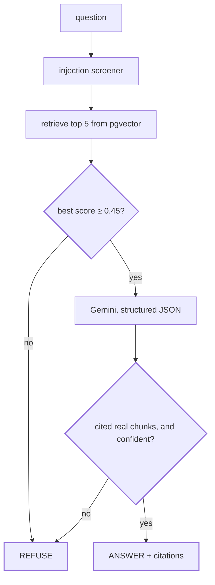

# DocSentry

A RAG document Q&A demo with guardrails. It answers questions about a fictional outdoor gear retailer, Meridian Outfitters, strictly from the company's handbook and policy documents. Every answer carries citations, anything outside the docs gets a polite refusal, and prompt injection attempts are flagged and ignored. Ships as a Docker image, deployable as a single API service or as the full stack with a worker, scheduler, TLS and dashboards.

Stack: FastAPI, LangChain 1.0 (LCEL chain, `langchain-google-genai`, `langchain-postgres`), Postgres with pgvector holding both the index and a per-request audit trail, Celery and Redis for index rebuilds, Gemini for embeddings and answers, React + Vite frontend served as static files by FastAPI. Optional Sentry and LangSmith. The index used to be a Chroma directory baked into the image at build time; `INFRA-MIGRATION.md` records why that had to change.

The chain is `retrieve -> grounding gate -> generate -> verify`. LangChain handles composition, retrieval and structured output. The two checks that decide whether an answer is allowed to reach the user stay in plain Python inside Runnables: an instruction telling a model to be careful is not the same thing as a guarantee. Those two checks are drawn out under [How an answer is decided](#how-an-answer-is-decided).

## Guardrails

| # | Layer | Where it runs | On failure |
|---|---|---|---|
| 1 | Input validation, 1 to 500 chars, control chars stripped | before anything | `400` |
| 2 | Injection screener: ignore-instructions phrasing, prompt fishing, role-play, exfiltration, jailbreaks | **before any LLM call** | flag and continue |
| 3 | `<user_question>` delimiters, declared untrusted in the system prompt | in the prompt | defence in depth only |
| 4 | Retrieval score threshold | after retrieval | refuse, **no model call** |
| 5 | Citation verification against chunks actually retrieved | after generation | refuse |
| 6 | Rate limit, 20/min per IP | per request | `429` |

Only layer 3 lives inside the prompt, and it is not load-bearing. Layers 4 and 5
are the ones that decide whether an answer ships, and both are plain Python. A
flagged question is still answered from the documents; the instruction inside it
is never obeyed.

## Evaluation

Every number here is reproducible by the demo command. Nothing is quoted that a
command in this repo cannot regenerate.

```bash
cd backend && pytest tests/eval -q          # sampled, the default
EVAL_SAMPLE=0 pytest tests/eval -q          # every question
python -m tests.eval.run_ablation           # the retrieval table below
python -m tests.eval.run_trace_report       # latency, tokens, cost
```

**Dataset.** 150 hand-labelled questions over a 25-document, 235-chunk corpus:
84 factual, 24 multi-hop, 16 ambiguous, and 26 unanswerable. Labels cite exact
sentences rather than chunk ids, so the same set scores every chunking strategy.
`validate_dataset.py` runs before any metric and fails if a cited sentence has
drifted out of the corpus.

**Retrieval ablation** (123 answerable questions, k=5, deterministic, no LLM):

| configuration | context recall | context precision | hit rate | MRR |
|---|---|---|---|---|
| naive fixed-size chunks | 0.935 | 0.236 | 0.967 | 0.833 |
| **semantic, section-aware** | **0.943** | 0.236 | **0.976** | **0.890** |
| hybrid BM25 + vector (RRF) | 0.927 | 0.229 | 0.967 | 0.849 |
| + lexical rerank | 0.809 | 0.200 | 0.878 | 0.730 |

Section-aware chunking wins, but the honest reading is that it barely improves
recall (0.943 against 0.935) and mainly improves *ranking* (MRR 0.890 against
0.833): the supporting chunk surfaces higher rather than merely appearing. Hybrid
retrieval and lexical reranking both made things worse on this corpus. They are
reported because they were tried, not omitted because they lost.

**Generation quality** (LLM-judged, sampled at n=5 with a fixed seed): RAGAS
faithfulness 0.975, answer relevancy 0.844, DeepEval hallucination 0.000. These
move a little run to run because they are judged by a model on a sample; the
gates sit below them rather than at them for that reason. Faithfulness is judged
against the full retrieved context rather than the truncated citation snippets,
which is the difference between a real measurement and one that scored 0.129 on
the same answers.

**Refusal.** Refusal recall 0.833 with an over-refusal rate of 0.167. The two are
gated asymmetrically: answering an unanswerable question invents policy someone
may act on, while refusing an answerable one is merely unhelpful. A refusal caused
by the generation call failing carries a `model_unavailable` flag and is excluded,
because scoring an outage as a correct refusal would report a broken run as
perfect behaviour.

**Prompt injection.** A 50-prompt suite across 15 techniques. The pattern screener
that runs before any model call flags 38 of the 43 injection prompts (88.4%), up
from 12 at the start of this work. The other 7 prompts assert a false premise
rather than injecting an instruction, and are handled by grounding instead; a test
asserts the screener flags none of them, because a screener broad enough to catch
those would fire on ordinary questions.

**Cost and latency.** p50 2,073 ms and p95 2,361 ms end to end, about 860 tokens
per request, roughly $0.11 per 1,000 requests on gemini-flash-lite. Latency is
measured locally because what matters is wall-clock time for the whole request,
including retrieval and the grounding checks. Run the command with nothing else
calling the API: a contended run reports contention, not the system.

> **These latency figures are stale as of 2026-09-12 and are kept only until they
> can be honestly replaced.** They were measured when the vector index was a
> Chroma directory inside the process. The index now lives in Supabase Postgres,
> so every retrieval crosses a network hop, and the current deployment puts the
> app and the database on different continents. Observed end to end today: about
> 5.4 s from a laptop, 8 to 11 s from the Render deployment. The token and cost
> figures are unaffected, since neither depends on where the index is stored.
>
> They are not simply overwritten with today's numbers because those describe a
> temporary arrangement nobody intends to keep. Regenerate them on the host that
> will actually serve traffic, with
> `python -m tests.eval.run_trace_report --limit 12`, and delete this note. See
> `INFRA-MIGRATION.md` and `DECISIONS.md` section 13.

`DECISIONS.md` records why each of these choices was made and what it costs.

## How an answer is decided



The two diamonds are the product. Everything else is plumbing.

## API

- `POST /api/chat` with `{ "question": "..." }` returns `{ answer, citations, refused, flags, latencyMs }`
- `GET /api/health` returns `{ status, documents, chunks }`
- `GET /api/sources` returns the indexed documents and their section counts

## Run locally

Backend (Python 3.11+):

```bash
cd backend
pip install -r requirements.txt
export GEMINI_API_KEY=your_key_here   # PowerShell: $env:GEMINI_API_KEY="..."
alembic upgrade head                  # creates the schema, needs DATABASE_URL
python -m app.ingest                  # embeds docs/ into pgvector
uvicorn app.main:app --reload --port 7860
```

Frontend (optional, for the chat UI):

```bash
cd frontend
npm ci
npm run build                         # then copy dist/ to backend/static/
npm run dev                           # or run the Vite dev server instead
```

Without a built frontend, the root URL serves a plain status message and the API remains fully usable.

Env vars: `GEMINI_API_KEY` (required), `DATABASE_URL` (required; a Postgres with the `vector` extension, e.g. the local container in `docker-compose.dev.yml` or a Supabase session-pooler URL, with the `postgresql+psycopg://` scheme), `GEMINI_MODEL` (default `gemini-flash-lite-latest`), `GEMINI_EMBED_MODEL` (default `gemini-embedding-001`, falls back to `gemini-embedding-2` on 404), `PORT` (default 7860). Optional: `SENTRY_DSN`, `TRUST_PROXY_HEADERS`. See `.env.example`.

The embed model matters beyond configuration. The index records which model built it and queries read that back, so a query can never silently use a different model than the index. A *reindex* with the variable set differently does rebuild on that model, which is why it is named explicitly wherever the stack is deployed.

Tracing is optional and off unless you set all three: `LANGSMITH_TRACING=true`, `LANGSMITH_API_KEY`, `LANGSMITH_PROJECT`. With them set, every request shows up in LangSmith as a four-step trace with token counts, per-step latency and the retrieved chunks.

## Deploy

The image builds the frontend, installs the backend, and starts uvicorn on port 7860. It does **not** build an index: the index lives in Postgres, so a deployment needs `DATABASE_URL` pointing at a database that already has one. Build-time secrets are no longer used for anything.

**Whole stack, one host** (`docker-compose.yml`): api, Celery worker, Beat and Redis from a single image, behind Caddy for TLS, with Grafana over the `events` table. Copy `.env.example` to `.env`, fill it in, then `docker compose up -d --build`. This is the only arrangement where the index can be rebuilt without a redeploy, because rebuilding is a Celery task and needs the worker.

**API only** (`render.yaml`): a single web service with no worker, no Beat and no Redis. It answers questions perfectly well and reports `degraded` on `/api/health`, because a missing broker means rebuilds are impossible, not that answers are. Set `GEMINI_API_KEY` and `DATABASE_URL` in the dashboard.

Rebuild the index after editing anything in `backend/docs/`, from somewhere with a worker:

```bash
docker compose exec -T api python -c "from app.tasks import reindex; print(reindex.delay().get(timeout=1800))"
```
